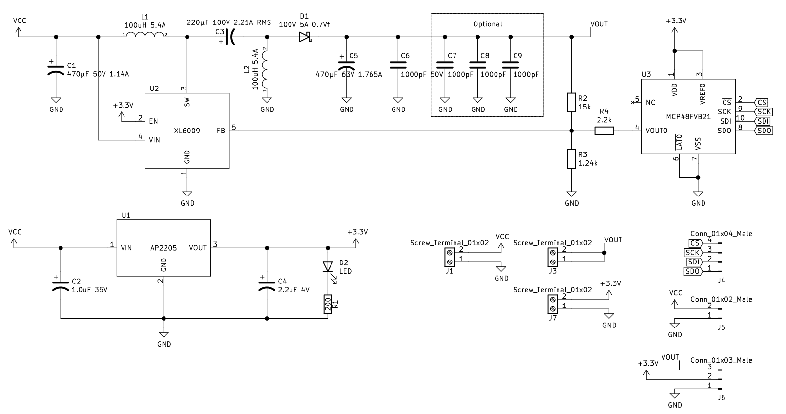
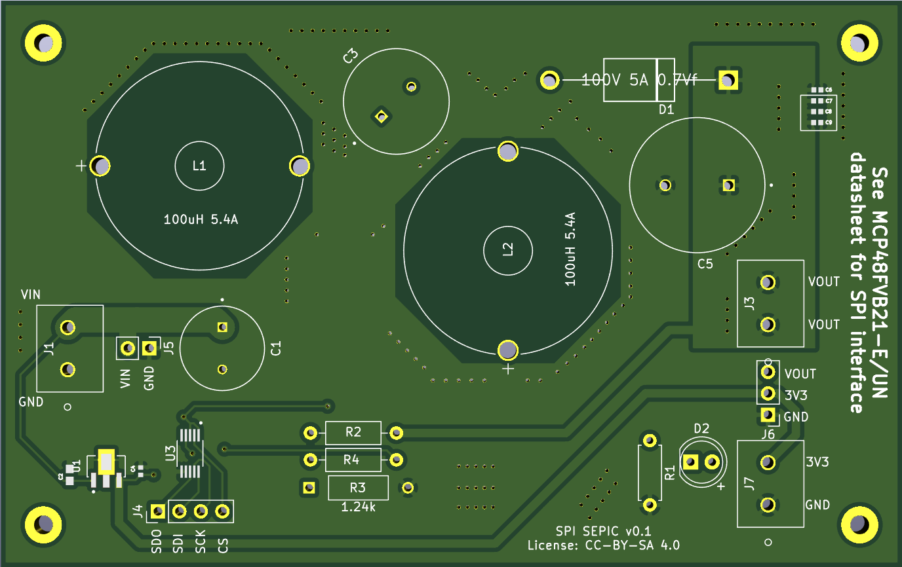
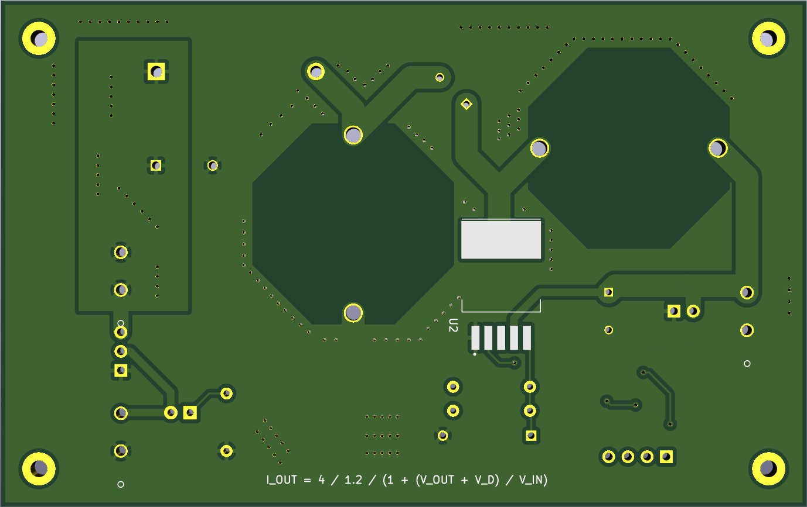
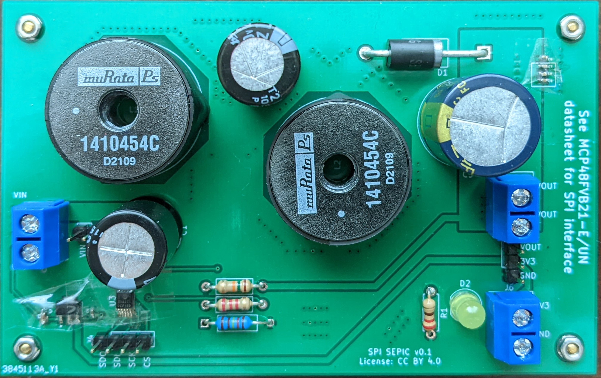
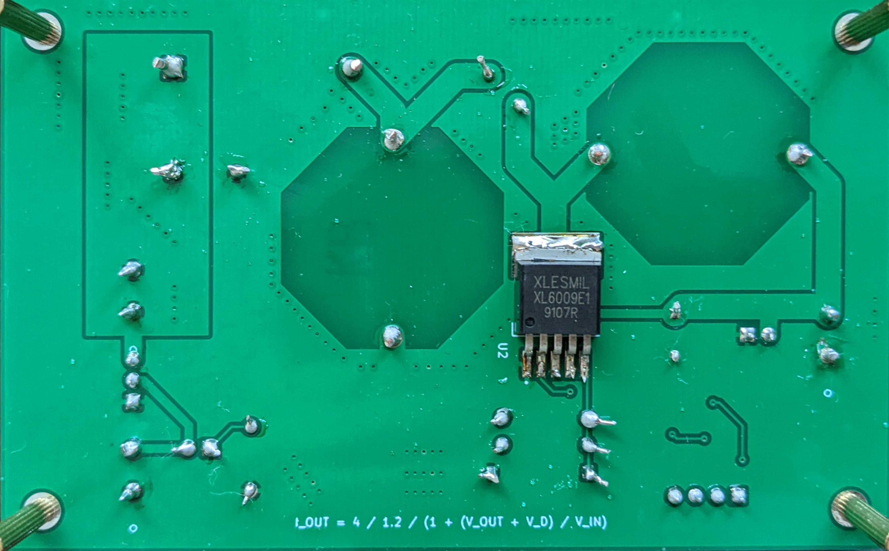

# SPI-SEPIC
SPI controlled SEPIC boost buck converter.

Input voltage range: 5\~24V
Output voltage range: 2.5\~24V

## Schematic

## PCB

Front                         |  Back
:----------------------------:|:----------------------------:
  |  
     |  

## Parts

Ref # | Name | Link
:---:|:-----:|:----:
R1 | 220 Resister | Generic Part
R2 | 15k Resister | https://www.digikey.com/en/products/detail/koa-speer-electronics-inc/CF1-4CT52R153J/13537263
R3 | 1.24k Resister | https://www.digikey.com/en/products/detail/yageo/MFR-25FBF52-1K24/13029
R4 | 2.2k Resister | https://www.digikey.com/en/products/detail/koa-speer-electronics-inc/CF1-4CT52R222J/13537295
U1 | AP2205-33Y-13 | https://www.digikey.com/en/products/detail/diodes-incorporated/AP2205-33Y-13/10107162
U2 | XL6009 | https://www.haoyuelectronics.com/Attachment/XL6009/XL6009-DC-DC-Converter-Datasheet.pdf
U3 | MCP48FVB21-E/UN | https://www.digikey.com/en/products/detail/microchip-technology/MCP48FVB21-E-UN/5773466
D1 | SB5H100-E3/73 | https://www.digikey.com/en/products/detail/vishay-general-semiconductor-diodes-division/SB5H100-E3-73/9600329?s=N4IgTCBcDaIMoCECsAJAjABgwWgKIGYB6AdnxAF0BfIA
D2 | 5mm LED | Generic Part
C1 | UVR1H471MHD1TO | https://www.digikey.com/en/products/detail/nichicon/UVR1H471MHD1TO/4328413
C2 | CGA3E1X7R1V105M080AC | https://www.digikey.com/en/products/detail/tdk-corporation/CGA3E1X7R1V105M080AC/4931462
C3 | 100ZLJ220M12.5X25 | https://www.digikey.com/en/products/detail/rubycon/100ZLJ220M12-5X25/3133967
C4 | C1005X6S0G225K050BC | https://www.digikey.com/en/products/detail/tdk-corporation/C1005X6S0G225K050BC/3951112
C5 | EEU-FC1J471 | https://www.digikey.com/en/products/detail/panasonic-electronic-components/EEU-FC1J471/266361
C6 C7 C8 C9 | 04025C102KAT2A | https://www.digikey.com/en/products/detail/kyocera-avx/04025C102KAT2A/563211
L1 and L2 | 1410454C | https://www.digikey.com/en/products/detail/murata-power-solutions-inc/1410454C/1924845

## SPI Command

See [MCP48FVBXX doc](https://ww1.microchip.com/downloads/en/DeviceDoc/20005466A.pdf) for the full details. For simple writes, send the following 24-bit command: 

Let `val` be the value of the 12-bit DAC. Value in range `[0, 4096)`)

Byte 0 | Byte 1 | Byte 2
:---:|:-----:|:----:
All 0 | `(val & 0xFF00) >> 8` | `val & 0xFF`

Note that due to part tolerances, you might need to calibrate the mapping with max output voltage (`val = 4095`) and min output voltage (`val = 0`)

## Change Log

 * v0.1: Initial version

This work is licensed under a
[Creative Commons Attribution-ShareAlike 4.0 International License][cc-by-sa].

[![CC BY-SA 4.0][cc-by-sa-image]][cc-by-sa]

[cc-by-sa]: http://creativecommons.org/licenses/by-sa/4.0/
[cc-by-sa-image]: https://licensebuttons.net/l/by-sa/4.0/88x31.png
[cc-by-sa-shield]: https://img.shields.io/badge/License-CC%20BY--SA%204.0-lightgrey.svg

